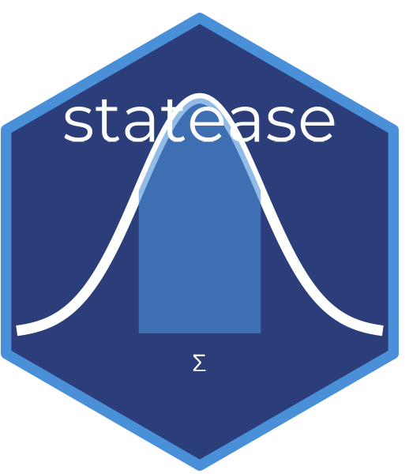

# statease 


> Statistical analysis with plain-English interpretation for R

## Overview

**statease** runs common statistical tests and returns each result together
with a plain-English interpretation, the effect size, the significance
decision, and, as of v1.4.0, a set of assumption checks relevant to that
specific test, shown by default rather than as an optional extra step.

statease does not replace statistical judgment. It cannot know your study
design, whether your sample was randomly selected, or whether an assumption
violation matters for your particular use case, no automated tool can.
What it does is surface the diagnostic information a careful analyst would
normally have to compute separately (normality, variance homogeneity,
multicollinearity, and several others depending on the test), clearly
labelled as **PASSED**, **WARNING**, or **NOTE**, so that information is in
front of you at the moment you read the result rather than something you
have to remember to go check yourself.

You can also describe your study design in a sentence, and statease will
echo it back alongside the interpretation as a reminder to read the result
in that context:

```r
ttest_interpret(x, y, context = "observational sample, not randomized")
```

## Installation

```r
install.packages("statease")
```

For the development version from GitHub:
```r
# install.packages("devtools")
devtools::install_github("DevWebWacky/statease")
```

## Live App
Try statease directly in your browser without installing R:

🌐 [Launch statease Shiny App](https://devwebwacky.shinyapps.io/statease/)

## Functions

| Function | What it does |
|---|---|
| `analyze()` | Master function - auto-detects and runs the right test |
| `describe()` | Descriptive statistics with interpretation |
| `ttest_interpret()` | T-tests, with normality and variance checks by default |
| `anova_interpret()` | One-way ANOVA with Tukey post-hoc, eta squared, and assumption checks |
| `anova2_interpret()` | Two-way ANOVA with Type II/III SS and assumption checks |
| `manova_interpret()` | MANOVA with Pillai's trace and follow-up ANOVAs |
| `chisq_interpret()` | Chi-square test with Cramer's V and expected-frequency checks |
| `fisher_interpret()` | Fisher's Exact Test with Odds Ratio |
| `mcnemar_interpret()` | McNemar's Test for paired categorical data |
| `cor_interpret()` | Correlation (Pearson, Spearman, Kendall) with linearity notes |
| `reg_interpret()` | Simple linear regression with normality, homoscedasticity, and independence checks |
| `mlr_interpret()` | Multiple linear regression, adding multicollinearity (VIF) checks |
| `logistic_interpret()` | Logistic regression with odds ratios and a separation diagnostic |
| `mannwhitney_interpret()` | Mann-Whitney U test (non-parametric) |
| `wilcoxon_interpret()` | Wilcoxon Signed Rank test (non-parametric) |
| `kruskal_interpret()` | Kruskal-Wallis test with post-hoc comparisons |
| `friedman_interpret()` | Friedman Test with Kendall's W |
| `check_assumptions()` | Run the same assumption checks on their own, before choosing a test |
| `power_interpret()` | Statistical power analysis and sample size calculation |
| `interpret_p()` | Standalone p-value interpreter |

## Usage

### One command does it all

```r
library(statease)

# Descriptive statistics
analyze(x = c(23, 45, 12, 67, 34), var_name = "Exam Scores")

# Independent samples t-test (auto-detected), with a study design note
analyze(x = c(23,45,12,67,34), y = c(19,38,22,51,29),
        var_name = "Scores",
        context = "convenience sample, not randomly assigned")

# Check assumptions before deciding on a test
analyze(x = c(23,45,12,67,34), y = c(19,38,22,51,29),
        check = TRUE)

# Non-parametric alternative (auto-detected)
analyze(x = c(23,45,12,67,34), y = c(19,38,22,51,29),
        nonparam = TRUE, var_name = "Scores")

# Correlation (auto-detected)
analyze(x = c(23,45,12,67,34), y = c(19,38,22,51,29),
        var1_name = "Exam Score", var2_name = "Study Hours")

# Chi-square (auto-detected)
analyze(
  x = c("Yes","No","Yes","Yes","No"),
  y = c("Male","Female","Male","Female","Male")
)

# One-way ANOVA (auto-detected)
df <- data.frame(
  score = c(23,45,12,67,34,89,56,43,78,90,11,34),
  group = rep(c("A","B","C"), each = 4)
)
analyze(formula = score ~ group, data = df)

# Two-way ANOVA (auto-detected)
df2 <- data.frame(
  score  = c(23,45,12,67,34,89,56,43,78,90,11,34),
  method = rep(c("Online","Traditional"), each = 6),
  gender = rep(c("Male","Female"), times = 6)
)
analyze(formula = score ~ method * gender, data = df2)

# Simple linear regression (auto-detected)
df3 <- data.frame(
  exam_score  = c(23,45,12,67,34,89,56,43,78,90),
  study_hours = c(2,5,1,7,3,9,6,4,8,10)
)
analyze(formula = exam_score ~ study_hours, data = df3)

# Power analysis
analyze(test_type = "ttest.two", effect_size = 0.5)

# Interpret any p-value
interpret_p(0.03, context = "treatment vs control group")
```

### What an assumption check actually looks like

Every relevant `_interpret()` function prints its assumption checks
automatically, whether or not anything is wrong:

```
  Assumption Checks:
    Normality (Group 1)    : PASSED   (Shapiro-Wilk p = 0.342)
    Normality (Group 2)    : WARNING  (Shapiro-Wilk p = 0.012, may not be normal)
    Equal variances        : PASSED   (Levene's p = 0.501)

  NOTE: Assumption checks are diagnostic tools and may be
  influenced by sample size and other characteristics of the
  data. Passing a check does not prove that an assumption is
  satisfied, and a warning does not automatically invalidate
  the analysis. Interpret these results alongside your
  knowledge of the data.
```

Checks are labelled one of three ways:
- **PASSED** : the package tested this and found no evidence of a problem
- **WARNING** : the package detected something worth your attention
- **NOTE** : something relevant to interpretation that the package cannot
  test automatically (independence of observations, for example, is a
  property of how the data was collected, not something computable from
  the numbers themselves)

## Why statease?

Most R output gives you numbers. statease gives you numbers, a plain-English
interpretation, and by default, the assumption context needed to read
that interpretation responsibly. It's built for:
- Students learning statistics
- Researchers who want fast, readable output without skipping diagnostics
- Educators teaching statistical concepts

## Changelog

### v1.4.0
- Assumption checks are now printed by default in every relevant
  `_interpret()` function, rather than requiring a separate call to
  `check_assumptions()`
- Added a `context` argument across all inferential functions and
  `analyze()`, letting users describe their study design and have it
  echoed back alongside the interpretation
- Added a numerical separation diagnostic to `logistic_interpret()`
- `reg_interpret()` and `mlr_interpret()` now check homoscedasticity and
  residual independence in addition to normality; `mlr_interpret()` also
  checks multicollinearity (VIF)
- `check_assumptions()`'s regression logic now shares its diagnostic
  calculations with `reg_interpret()` and `mlr_interpret()`, rather than
  three separate implementations
- Fixed a boundary bug in `power_interpret()` where an effect size exactly
  equal to a Cohen's convention threshold was labelled one category too high
- Fixed a bug where `anova2_interpret()`'s printed report did not display
  the Sum of Squares type
- Fixed a bug where `chisq_interpret()` triggered R's internal
  chi-squared approximation warning twice
- Fixed a bug where `lm()`/`glm()` fitted inside a wrapper function could
  cause `car::ncvTest()` to fail silently when computing homoscedasticity
- Several formatting fixes in non-parametric test output

### v1.3.0
- Added `fisher_interpret()` for Fisher's Exact Test
- Added `mcnemar_interpret()` for McNemar's Test
- Added `friedman_interpret()` for Friedman Test
- Added `check_assumptions()` for automated assumption checking
- Added `power_interpret()` for power analysis and sample size
- Added Shiny app via `run_app()` for point-and-click analysis
- Updated `analyze()` with `check` and `test_type` arguments

### v1.2.1
- Fixed non-parametric interpretation — stochastic superiority
  correctly reported instead of median differences

### v1.2.0
- Added `mlr_interpret()` for multiple linear regression
- Added `logistic_interpret()` for logistic regression
- Added `manova_interpret()` for MANOVA
- Added `mannwhitney_interpret()` for Mann-Whitney U test
- Added `wilcoxon_interpret()` for Wilcoxon Signed Rank test
- Added `kruskal_interpret()` for Kruskal-Wallis test
- Updated `analyze()` with `nonparam` argument

### v1.1.0
- Added `chisq_interpret()` for chi-square tests
- Added `cor_interpret()` for correlation analysis
- Added `reg_interpret()` for simple linear regression
- Added `anova2_interpret()` for two-way ANOVA
- Updated `analyze()` to auto-detect all new tests

### v1.0.0
- Initial CRAN release
- `describe()`, `ttest_interpret()`, `anova_interpret()`,
  `interpret_p()`, `analyze()`

## License
MIT
